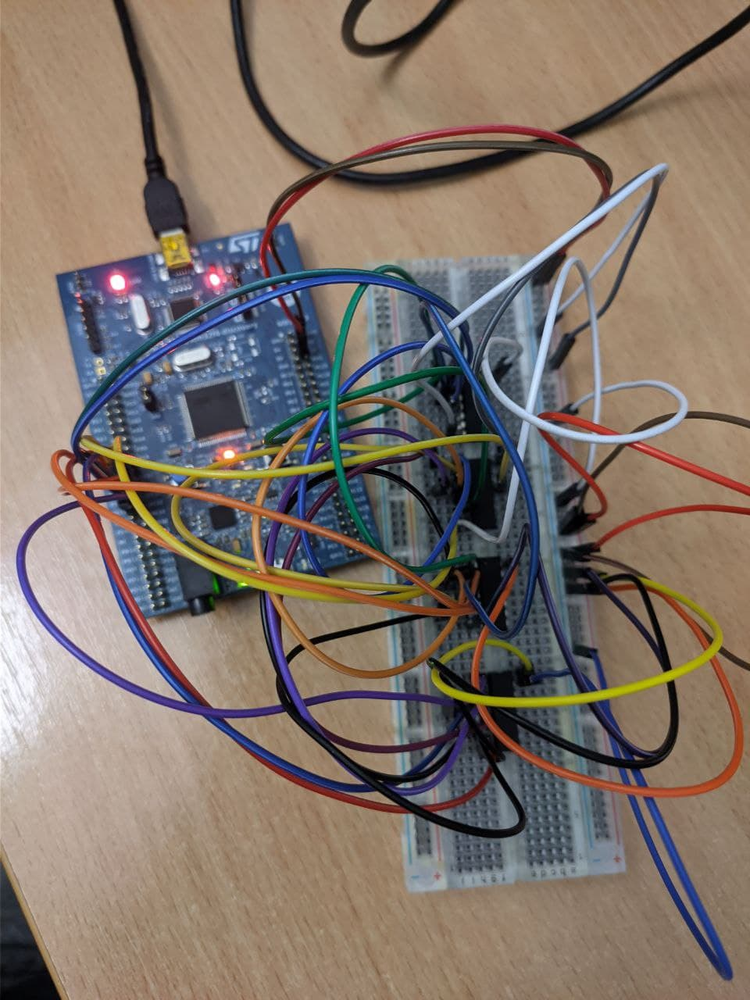
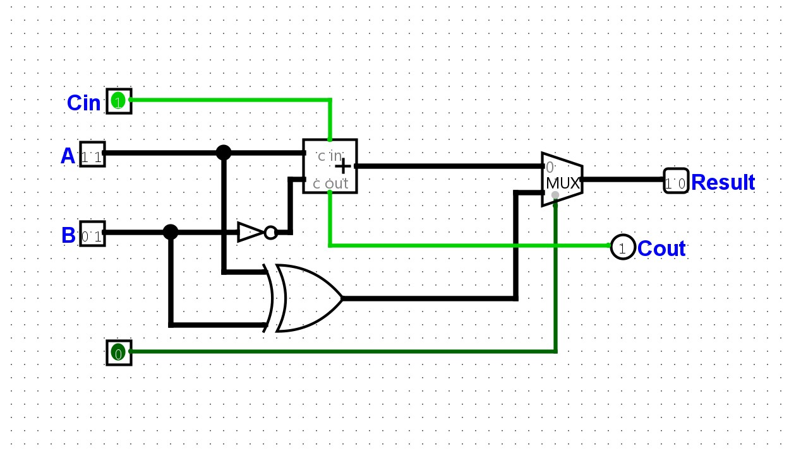

# Lab work <mark>8</mark>: ALU  
Authors (team): Ustym Hanyk https://github.com/UstymHanyk 
Variant: 13, substraction and xor

### Results
Detailed video proof: https://youtu.be/_7khEWX3CtA

All tests are conducted in main.c, depending on the results, either Orange(success) or Blue(failure) will be turned on the stm32 board

### Scheme

### Scheme

